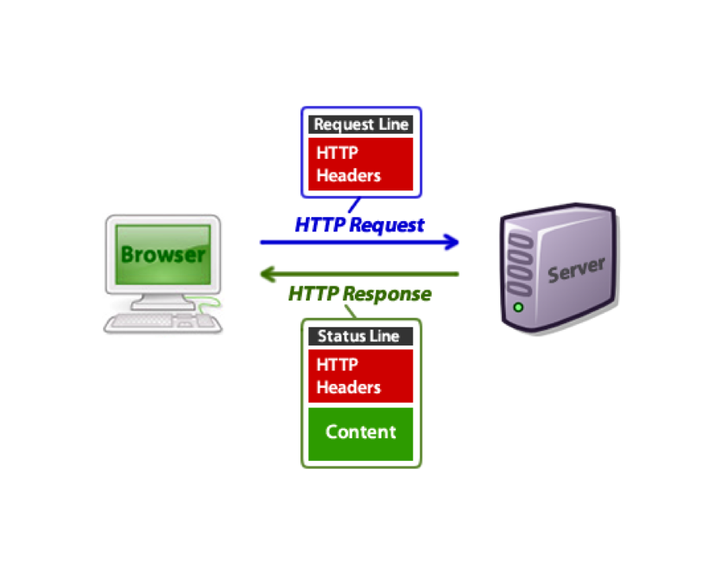

# PHP Forms

## HTML Forms
- A  form is the usual way to get information from a browser to a server
- HTML has tags to create a collection of objects that implement this information gathering
- All of the controls of a form are  defined in the content of a `<form>` tag

### Form processing
- When the Submit button of a form is clicked, the form’s values are sent to the server for processing
- The only required attribute of `<form>` is `action`,  which specifies the URL of the application that is to be called when the `submit` button is clicked
- Example: `<form action = "popcorn.php" method = "post">`

### Form Controls
- Many are created with the `<input>` tag
- The name attribute identifies the field when processing
- The type attributes specifies the control type
- [Values](http://www.w3schools.com/tags/att_input_type.asp)
- Other control tags
  - `<select>`
  - `<textarea>`


### Text box
- Creates a horizontal box for text input
- [Useful attributes](http://www.w3schools.com/tags/tag_input.asp)
- Example:`<input type = "text" name = "Phone" size = "12" />`

### Password
- Just like text except asterisks are displayed instead of input characters

### Checkbox
- Used to collect multiple choice input
- A value attribute is required.
- To initialize a checkbox as checked, the checked attribute must be included
- Example:
```
<input type="checkbox" value="gen ed" name="reason" > Gen Ed <br/>
<input type="checkbox" value="elective" name="reason" > Elective <br/>
<input type="checkbox" value="major" name="reason" checked > Major <br/>
```

### Radio Buttons
- Mutually exclusive checkboxes
- Every button in a radio button group MUST have the same name
- Example:
```
<input type="radio" value="gen ed" name="reason" > Gen Ed <br/>
<input type="radio" value="elective" name="reason" > Elective <br/>
<input type="radio" value="major" name="reason" checked > Major <br/>
```

### Labels
- Controls can be embedded in label elements
```
<label> Phone:
   <input type = "text" name = "phone" />
</label>
```

### Selection box
- Uses the `<select>` tag
- Each item is specified with an `<option`> tag
- Example:
```
<select name="reason">
    <option>Gen Ed</option>
    <option>Elective</option>
    <option>Major</option>
</select>
```

### Text Areas
- Created with `<textarea>`
- Usually include the rows and cols attributes to specify the size of the text area
- Example: `<textarea rows="4" cols="50">Comments</textarea>`

### Reset and Submit Buttons
- Both are created with `<input>`
```
<input type = "reset"  
       value = "Reset Form" />
<input type = "submit"  
       value = "Submit Form" />
```
- Submit encodes the form data of the form and requests execution of the program specified as the  value of the action attribute of form.
- A submit button is required in every form.

## HTML Processing

### HTTP Overview


### HTTP Request
- Header information
```
GET /index.html HTTP/1.1
```

- Optional header information
```
User-Agent:  Mozilla/5.0 (Windows 2000; U) Opera 6.0 [en]
Accept: image/gif, image/jpg,  text/*, */*
```
- Body (optional)

### HTTP Response
- The status
```
HTTP/1.1 200 OK
```

- Additional headers
```
 Date:  Sat 22 Jan 2006 20:25:12 GMT
Server:  Apache 1.2.22 (Unix) mod_perl/1.26 PHP/5.0.4
Content-Type:  text/html
Content-Length: 141
```

- Body (optional)

### HTTP Methods
- The two most common methods are `GET` and `POST`
- `GET` is designed for retrieving information from the server.
- `POST` is meant for posting information to the server.

### HTTP `GET` Request


- Sent as part of the URL
  - `search` is the name of Google’s server-side form handler
  - `?` Is a query string
    - Name/value pair
    - Multiple search strings are separated by &

### `POST` Requests
- Used to send data to the server to be processed in some way, like by a PHP script.
- The most common use of POST, by far, is to submit HTML form data to scripts.

## Processing Forms

### Superglobal Variables
- Built-in variables that are always available in all scopes
- `$_COOKIE`
- `$_GET`
- `$_POST`
- `$_FILES`
- `$_SERVER`
- `$ENV`


### Processing Forms
- Use the `$_POST`, `$_GET` and `$_FILES` arrays to access form parameters from your PHP code
- Copy the values from the array to a variable for processing
- Example:
```
$title = $_POST['title'];
```
- The type of method used to request a PHP page is available through `$_SERVER['REQUEST_METHOD']`
- Example: [popcorn.html](../popcorn.html)

## [Lab Exercise 4](../exercises/exercise-4.md)
